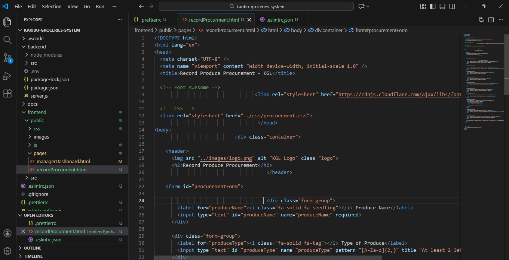
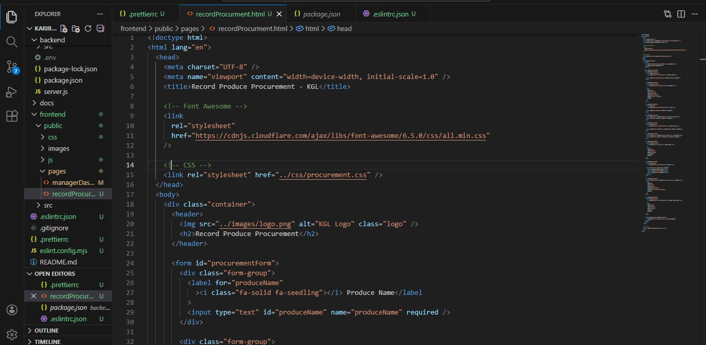

# Karibu Groceries LTD System

A web-based stock and user management system for a wholesale cereal distributor.

## Tech Stack
- HTML, CSS, JavaScript
- Vue.js
- Node.js & Express
- MongoDB

## Features
- Role-based dashboards
- Stock management
- Sales & credit tracking
- Aggregated reports

Before using Prettier, some of the HTML code in this project had indentation errors, making it harder to read and maintain.

After running Prettier, all the HTML code was automatically formatted with proper indentation, spacing, and consistent styling. This makes the code cleaner, easier to read, and more professional.